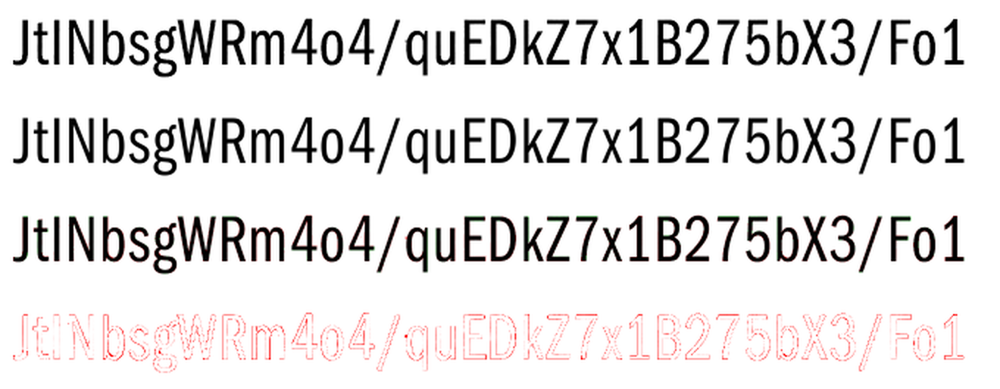

# glyphid

Resolves visually confusable characters — `0` vs `O`, `I` vs `l` — in rendered text
textures, by measuring glyph geometry from pixel coverage rather than by pattern-matching
against a re-rendered reference.

Built for the Black Ops III cipher textures (Franklin Gothic URW Comp Book), where the
distinction between `0`/`O` and `I`/`l` changes the decrypted plaintext.

---

## 1. Architecture

### Why not match the antialiasing

The obvious approach is to re-render candidate text and compare pixels. This fails here.
The textures were authored around 2012–2013, and the exact rasteriser, hinting mode,
gamma and filter kernel are unknown and not reproducible by any current tool. Sweeping
Photoshop's antialiasing modes searches a space that does not contain the answer.

More fundamentally, it is the wrong measurement. The difference between `I` and `l` is
0.32 px of stem width; the residual from an antialiasing mismatch is comparable or
larger. A pixel-difference score is therefore dominated by the unknown nuisance parameter
rather than by the signal.

The alternative used here: **measure quantities that no antialiaser can change.**
Antialiasing redistributes ink within a neighbourhood but conserves its total. Any
renderer that sets a pixel's value in proportion to the outline area covering it — which
is what every grayscale text rasteriser does — preserves coverage integrals exactly. Sums
and ratios of those integrals are therefore invariant to the filter kernel, the sub-pixel
phase, and the paper's gamma.

This turns an unbounded search over rendering parameters into a direct measurement with a
known error budget.

### What is being measured

The font outlines determine the discriminator. Franklin Gothic's `I` and `l` are plain
rectangles of *identical* height (0→667 units), differing only in width:

```
I: (64,0) (64,667) (140,667) (140,0)   width 76 units
l: (59,0) (59,667) (128,667) (128,0)   width 69 units
```

So stem width alone separates them, by 10.1%. The coverage sum along any horizontal row
crossing only the stem *is* that width, exactly, under area-preserving antialiasing.
Averaging over the stem's central rows reduces noise by the square root of the row count.

`0` and `O` are structurally similar — identical height (691 vs 692), near-identical
stroke thickness (77 vs 79), differing in width (366 vs 395). `O` is essentially a
horizontally stretched `0`.

Width/height would be the direct analogue, but sub-pixel edge localisation on a *curve*
is far less reliable than on a straight vertical stem. Measured across sizes 44.5–47.5
and blur 0–0.6, ranked by separation divided by jitter:

| Descriptor | `0` | `O` | Separation | Sep/jitter |
| --- | --- | --- | --- | --- |
| **moment aspect** (used) | 0.5937 | 0.6291 | 6.0% | **18.8** |
| ink area | 106685 | 115512 | 8.3% | 20.0 |
| outer W/H | 0.5331 | 0.5739 | 7.7% | 6.2 |
| outer width | 370.3 | 400.0 | 8.0% | 4.1 |
| counter width | 46.6 | 56.9 | 22.2% | 1.6 |

Larger separation is not automatically better. Counter width has the widest gap but the
worst reliability, being a difference of two measured quantities whose errors compound.
Ink area scores marginally highest but requires *absolute* calibration against a gain
factor that varies with background estimation; moment aspect (`rms_x / rms_y`) is a pure
ratio within a single glyph and self-calibrates. It also uses every ink pixel rather than
just the edges, which is why its jitter is an order of magnitude lower.

| Pair | Measurement | Reference values | Separation |
| --- | --- | --- | --- |
| `I` / `l` | stem width, font units per em | 76 vs 69 | 10.1% |
| `0` / `O` | x-spread / y-spread of ink | 0.594 vs 0.629 | 5.8% |

### Pipeline

**1. Ink coverage.** Recover coverage as `1 - luminance / background`. The background
must be estimated because the paper is textured and unevenly lit. A morphological closing
would work but takes a local *maximum*, biasing the estimate high and inflating every
integral. Instead the background is a **normalised convolution**: a Gaussian-weighted
mean over non-ink pixels only, with the ink hole filled by interpolation from surrounding
paper. This is unbiased, which matters because the measurements are integrals of the
result.

Two coverage maps are produced. A *gated* map, for segmentation, uses **hysteresis**:
pixels are kept only if they exceed a low threshold *and* lie within a few pixels of a
solidly inked seed. Plain connected-component hysteresis is insufficient because faint
paper texture can bridge a scratch into a glyph and chain across the image, so the keep
mask is additionally distance-limited via a dilation of the seed set. A *raw* map, for
measurement, is ungated and **unclipped** — clipping at zero would rectify background
noise and bias every integral upward, whereas signed residuals average out.

**2. Line segmentation.** A horizontal ink projection splits the page into text lines.

**3. Layout fit.** Reference glyphs are rasterised by supersampling 8× and box-filtering
down, giving area coverage accurate to ~0.2% against the analytic outline area. Glyphs
are stamped at explicit sub-pixel pen positions, so size, tracking, origin and baseline
are continuous parameters.

Fitting all four jointly is ill-conditioned: the optimiser trades translation against
scale and stalls in local minima. Translation is therefore separated out and solved in
closed form by **FFT cross-correlation** — for each candidate (size, tracking) the best
integer offset is the peak of the correlation surface, computed via `fftconvolve`. Only
the remaining parameters go to the local optimiser.

**4. Per-glyph tracking.** A single uniform tracking value accumulates error along a
line; by the far end, glyphs are misplaced by several pixels and windows land on the
wrong glyph. Instead each glyph is located sequentially left to right, seeded from the
*measured* position of its predecessor plus one advance width. This keeps the local
search window small regardless of how the line's true tracking differs from the fitted
average.

**5. Isolation.** Inter-glyph gaps are only ~4 px, so neighbouring ink contaminates any
measurement window. Two mechanisms remove it: all *other* glyphs are rendered from the
fitted layout and subtracted, and the result is masked to the union of the two
candidates' renders dilated by 2 px, so residue outside the glyph's plausible support
cannot enter the integral.

**6. Discrimination.** The relevant descriptor is evaluated on the isolated patch and on
clean renders of both candidates at the fitted size. The result is expressed as a
position between the two references, so the output states not just which letter but how
far from the decision boundary the measurement fell.

**7. Convergence.** `0` and `O` have different advance widths (426 vs 477 units), so a
wrong character in the input transcription displaces every glyph after it and degrades
the fit. The tool therefore does not trust its input: it fits the layout, decides every
ambiguous glyph, substitutes the results, and **re-fits with the corrected text**,
repeating until the text stops changing. The output is a fixed point of this loop, which
is what makes it independent of the initial transcription.

---

## 2. Files

| File | Role |
| --- | --- |
| `extract.py` | Background estimation and ink-coverage recovery from a textured, alpha-cut page; line segmentation. |
| `render.py` | Supersampled reference rasteriser and font metrics (advances, ink bounds, outline areas) via fontTools. |
| `fit.py` | Per-line size / tracking / origin fit, with translation resolved by FFT cross-correlation. |
| `metrics.py` | Shape measurements built from coverage integrals: stem width, extents, moments. |
| `solver.py` | Sequential glyph tracking, neighbour subtraction and support masking, and the discriminator definitions. |
| `identify.py` | CLI. Runs the fit → decide → re-fit loop to convergence and reports per-glyph verdicts. |
| `preview.py` | CLI. Writes upscaled per-line images used to produce the initial transcription. |
| `compare.py` | CLI. Reconstructs the page from the fit, reports recovered typography, and writes overlay / residual images. |
| `der_riese_lines.txt` | Resolved transcription of the Der Riese cipher texture. |
| `docs/` | Reference overlay images. |
| `tests/` | Standalone test suite (see below). |

`glyphid` is self-contained. Its tests are excluded from the main cipher suite, which
pins `testpaths = tests`.

---

## 3. Usage

Requires `numpy`, `scipy`, `pillow` and `fonttools`.

```bash
export IMG=path/to/texture.tif
export FONT=path/to/font.ttf
```

### Step 1 — Confirm the font (optional, but establishes the error budget)

```bash
python3 -c "
from fontTools.ttLib import TTFont
from fontTools.pens.recordingPen import RecordingPen
t=TTFont('$FONT'); gs=t.getGlyphSet()
for ch in ['I','l']:
    p=RecordingPen(); gs[ch].draw(p)
    print(ch, [a[0] for o,a in p.value if o in ('moveTo','lineTo')])"
```

```
I [(64, 0), (64, 667), (140, 667), (140, 0)]
l [(59, 0), (59, 667), (128, 667), (128, 0)]
```

Identical heights, widths 76 and 69 — a 10.1% target separation.

### Step 2 — Extract and preview the lines

```bash
python3 -m glyphid.preview "$IMG" --out-dir previews
```

```
line 0: y=41-85 x=22-168 (1 chunk(s))
line 1: y=132-184 x=25-1004 (2 chunk(s))
line 2: y=222-275 x=23-1012 (2 chunk(s))
line 3: y=313-366 x=24-1006 (2 chunk(s))
line 4: y=404-457 x=23-682 (2 chunk(s))

wrote 9 preview(s) to previews/
```

### Step 3 — Transcribe

Read `previews/*.png` and write one line per text line. **Every `0`, `O`, `I` and `l` may
be guessed arbitrarily** — they are re-decided from the pixels. All other characters must
be correct, as they anchor the layout fit.

```bash
cat > lines.txt <<'EOF'
TheGiant
kCmIgFi6GUJNgkNI1Q41fbfyLoCFTCvIqkZiIOKIAXAzP1U1uy1BE4U
fPBfpKmmLObjYnQNRBaPtKiVWzc5A4vOw3xIe8FOhAGJZ7g4inOwn
dJxMOvO3dc1M82at2T6935roTqyWDgtGD/hwwRF3oHqFM5Vcw1
JtINbsgWRm4o4/quEDkZ7x1B275bX3/Fo1
EOF
```

### Step 4 — Identify

```bash
python3 -m glyphid.identify "$IMG" --font "$FONT" --text-file lines.txt --json report.json
```

```
line 1   size=45.74px  corr=0.9946
  in   kCmIgFi6GUJNgkNI1Q41fbfyLoCFTCvIqkZiIOKIAXAzP1U1uy1BE4U
  out  kCmlgFi6GUJNgkNI1Q41fbfyLoCFTCvlqkZil0KIAXAzP1U1uy1BE4U
          ^                           ^    ^^
   OK [  3] l -> l   stem width (font units) = 64.22921   (I=76.01027, l=68.31601)   margin=206.2%
   OK [ 15] I -> I   stem width (font units) = 81.82536   (I=76.01027, l=68.31601)   margin=251.2%
   OK [ 31] l -> l   stem width (font units) = 67.12787   (I=76.01027, l=68.31601)   margin=130.9%
   OK [ 36] l -> l   stem width (font units) = 66.30343   (I=76.01027, l=68.31601)   margin=152.3%
   OK [ 37] 0 -> 0   x-spread / y-spread = 0.59361   (0=0.59416, O=0.62853)   margin=103.2%
   OK [ 39] I -> I   stem width (font units) = 74.61630   (I=76.01027, l=68.31601)   margin= 63.8%
```

Final output:

```
TheGiant
kCmlgFi6GUJNgkNI1Q41fbfyLoCFTCvlqkZil0KIAXAzP1U1uy1BE4U
fPBfpKmmLObjYnQNRBaPtKiVWzc5A4v0w3xle8FOhAGJZ7g4in0wn
dJxMOvO3dc1M82at2T6935roTqyWDgtGD/hwwRF3oHqFM5Vcw1
JtINbsgWRm4o4/quEDkZ7x1B275bX3/Fo1
```

### Step 5 — Verify convergence

The result should not depend on the transcription. Flip every ambiguous character and
confirm the output is unchanged:

```bash
python3 -c "
import sys
t=str.maketrans({'0':'O','O':'0','I':'l','l':'I'})
for line in open('lines.txt'): sys.stdout.write(line.rstrip('\n').translate(t)+'\n')
" > lines_flipped.txt

python3 -m glyphid.identify "$IMG" --font "$FONT" --text-file lines_flipped.txt | tail -6
```

### Step 6 — Reconstruct and compare

Rebuild the page from the fitted parameters, report the recovered typography, and write
the overlay images:

```bash
python3 -m glyphid.compare "$IMG" --font "$FONT" --text-file lines.txt \
    --out overlay.png --stacked stacked.png
```

```
line    size          tracking    left  baseline    corr     rms
   0   45.45    1.01 +-0.15 px    28.9      78.0  0.9949  0.0393
   1   45.74    1.05 +-0.56 px    28.7     168.9  0.9946  0.0394
   2   45.53    0.99 +-0.25 px    28.7     260.0  0.9950  0.0392
   3   46.06    0.70 +-0.28 px    28.6     351.1  0.9911  0.0497
   4   45.48    1.00 +-0.14 px    28.8     441.9  0.9952  0.0369

body text: size 45.70 +-0.23 px, tracking 0.93 +-0.14 px (20/1000 em)
line spacing: 91.0 +-0.1 px (1.993 x size)
```

`--stacked` writes four panels — original, reconstruction, overlay, amplified residual:



In the overlay, ink present in both reads black; observed-only reads magenta and
reconstruction-only reads green. The residual panel is the absolute difference at 3x
gain.

### Step 7 — Run the test suite

```bash
python3 -m pytest glyphid/tests -q
```

```
21 passed
```

### Reading the output

```
OK [ 15] I -> I   stem width (font units) = 81.83   (I=76.01, l=68.32)   margin=251.2%
?? [  3] l -> l   stem width (font units) = 72.10   (I=76.01, l=68.32)   margin= 15.0%
```

`margin` is distance from the decision boundary as a percentage of half the gap between
references. 100% means the measurement landed exactly on a reference; 0% means exactly
halfway between them. Values above 100% fall outside the reference pair, which is normal
— rasterisation and stroke rendering do not reproduce outline widths to the last percent.
Rows flagged `??` fell within 25% of the boundary and warrant a manual look.

`--json` writes the full per-glyph record: measured value, both references, position,
margin and confidence.

---

## 4. Notes

### Recovered typography

The layout fit is a measurement in its own right. For the Der Riese texture (1024x512):

| Property | Value | Notes |
| --- | --- | --- |
| Typeface | Franklin Gothic URW Comp **Book** | Book fits at 0.977 correlation, Demi at 0.790 |
| Font size | **45.70 ± 0.23 px** | body lines; ~46 px is a fair round number |
| Character spacing | **0.93 ± 0.14 px** (≈20/1000 em) | extra tracking on top of the font's own advances |
| Line spacing | **91.0 ± 0.1 px** | 1.993 x font size, i.e. exactly double-spaced |
| Left margin | **28.7 ± 0.1 px** | consistent across all five lines |
| Baselines | 78.0, 168.9, 260.0, 351.1, 441.9 px | steps of 91.0, 91.1, 91.1, 90.8 |

Two of these are strong independent evidence that the fit is correct rather than merely
optimised: the left margin agrees to ±0.1 px across five lines that were fitted
*separately*, and line spacing lands on 1.993x size when a designer would have set
exactly 2.0x. Neither quantity is constrained by the fit, so their consistency is a
genuine cross-check.

Per-line spread is small but not zero (45.45–46.06 px). This is fit noise, not real
variation — most likely all five lines were set identically at 46 px.

### Reconstruction quality

Line correlations 0.9911–0.9952, RMS coverage error 0.037–0.050. Line 3 is consistently
the weakest, and is also the line whose tracking estimate (0.70 px) departs from the
others; it contains the most tightly-set glyph pairs.

The residual panel is the useful diagnostic. A correct fit leaves only **thin, symmetric
outlines** at glyph edges — that is sub-pixel edge placement and antialiasing-model
mismatch, which is expected and harmless because the discriminators integrate over it. A
*wrong* fit leaves solid one-sided blocks where a glyph is displaced or misidentified.
The Der Riese reconstruction shows only the former.

### Confidence

All 14 ambiguous glyphs resolved with no low-confidence results.

```
glyphs decided: 14      low-confidence: 0
margins:  min 61.1%     median 114.5%   max 251.2%
```

The measurements are cleanly bimodal with no overlap, which is the strongest available
evidence that the discriminator is reading real structure rather than noise:

```
I/l stem width (units)          0/O aspect
  l  64.23                        0  0.5936
  l  66.30                        0  0.5948
  l  67.13                        0  0.5997
  l  69.68    <- l cluster max    ------------ boundary 0.611
  ------------ boundary 72.2      O  0.6268
  I  74.62    <- I cluster min    O  0.6305
  I  76.72                        O  0.6322
  I  81.83                        O  0.6382
```

Nearest approach to the `I`/`l` boundary is 2.4 units, against a 7.7-unit reference gap.

### Error threshold

The `??` flag triggers below 25% margin. In practice a margin under ~30% means the
measurement fell in the middle third between references and should be checked by eye. On
this texture nothing came close.

Dominant error sources, in order: fitted font size (~0.5% across lines, versus a 10%
target separation for `I`/`l`), residue from imperfect neighbour subtraction on tightly
spaced glyphs, and background estimation near the page's torn border.

### Hinting is a hard requirement

The method assumes **unhinted** grayscale antialiasing. Hinting snaps stems to whole
pixel widths, which forces `I` and `l` to render identically and destroys the distinction
irrecoverably — no measurement can recover it afterwards.

Check any new asset before trusting a result: stem edges must show *fractional* coverage.
The Der Riese texture has an edge width of 1.82 px with partial-coverage columns, so it
is unhinted. If stems land on exact pixel boundaries with hard 0/1 transitions, stop —
the information is not present.

### Scope and assumptions

- The non-ambiguous characters in the transcription must be correct. They anchor the
  layout fit; errors there degrade the fit and can propagate.
- One font, weight and size per line. Mixed runs are not handled.
- Text must be axis-aligned. There is no rotation or perspective correction.
- Only `0`/`O` and `I`/`l` are decided. Other pairs are left alone, deliberately —
  admitting visually distinct candidates such as `Q` or `D` introduces failure modes
  without benefit, since a human reads those reliably.

### Possible improvements

- **Per-line size from unambiguous glyphs only.** Size is currently fitted on the whole
  line including ambiguous characters. Fitting on the unambiguous subset would remove a
  small circularity.
- **Joint decoding.** Each glyph is decided independently. A joint fit over a line, with
  advance widths as coupled evidence, would extract information currently unused: `I` and
  `l` differ by 17 units of advance, so a run of them shifts subsequent glyphs
  measurably.
- **Automatic transcription.** The non-ambiguous characters are still typed by hand.
  Since references for every glyph are already available, a nearest-match pass over the
  fitted layout could bootstrap the transcription.
- **Confidence from noise, not geometry.** Margins are currently expressed against the
  reference gap. Propagating measured background noise into a per-glyph error bar would
  give a calibrated probability instead.
- **Reuse the recovered typography.** Size, tracking and line spacing are re-fitted per
  line. Since they are demonstrably uniform across the page, fitting them once globally
  would tighten the per-line size estimate and remove the largest error term.
